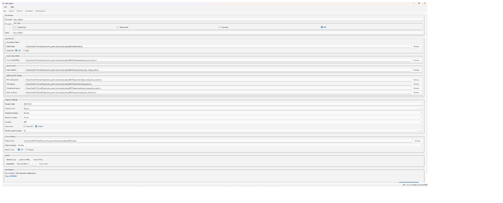
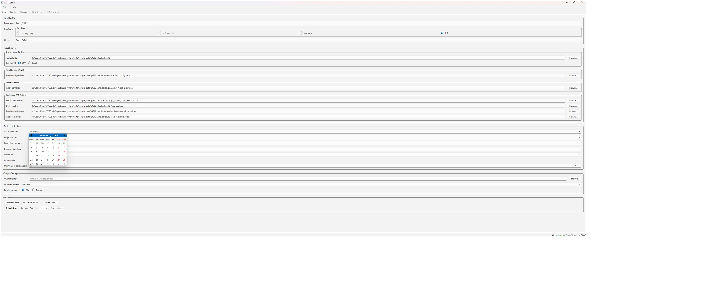
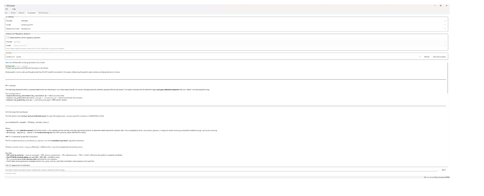

# PythonALM

<div align="center">

[](./LICENSE)
[](https://www.python.org/)
[](https://www.riverbankcomputing.com/software/pyqt/)
[](https://fastapi.tiangolo.com/)
[](https://numpy.org/)
[-D97757?logo=anthropic&logoColor=white)](https://www.anthropic.com/)

[](https://www.linkedin.com/in/shahril-m-b4071124/)

### Institutional-grade Asset and Liability Modelling for Life Insurance — built in Python.

Deterministic, stochastic, and BPA runs. IFRS 17 GMM. Solvency II BSCR. Matching Adjustment. AI-assisted actuarial analysis.

[📬 Contact](mailto:mohd.shahrils@yahoo.com) · [💼 LinkedIn](https://www.linkedin.com/in/shahril-m-b4071124/)



<table>
  <tr>
    <td align="center" width="33%">
      <a href="images/ALM_System_Terminal.jpg">
        
      </a>
      <br/><sub><b>Run Configuration</b></sub>
    </td>
    <td align="center" width="33%">
      <a href="images/ALM_System_Run_Settings.jpg">
        
      </a>
      <br/><sub><b>Projection Settings</b></sub>
    </td>
    <td align="center" width="33%">
      <a href="images/ALM_System_AIChat.jpg">
        
      </a>
      <br/><sub><b>AI Assistant</b></sub>
    </td>
  </tr>
</table>

</div>

---

## About

**PythonALM** is a production-grade Asset and Liability Model (ALM) built for life insurance actuarial teams. It projects fund-level asset and liability cash flows across multiple run modes, calculates IFRS 17 Gross Margin Model metrics, computes Solvency II Standard Formula SCR, and applies Matching Adjustment — all within a single integrated Python system.

The platform is designed around a clean separation of concerns: a pure calculation engine (`engine/`) with no external dependencies, a FastAPI backend for run orchestration, an RQ + Redis job queue for background processing, and a PyQt6 desktop application for configuration and analysis. An AI assistant layer provides interactive analysis, regulatory Q&A, and modelling guidance directly within the UI.

> **This repository is a public demonstration build.** Certain proprietary implementations are stubbed. The architecture, interfaces, and modelling scope are representative of the production system.

---

## Features

| Feature | Description |
|---|---|
| **Multi-Mode Projection Engine** | Liability-Only, Deterministic, Stochastic (Monte Carlo), and BPA (Bulk Purchase Annuity) run modes |
| **IFRS 17 GMM Engine** | CSM tracking, Risk Adjustment (CoC method), LRC/LIC split, loss component, coverage units — JAX JIT-compiled inner step |
| **Solvency II Standard Formula** | Spread stress, interest stress, longevity stress, lapse/expense/currency/counterparty modules, BSCR aggregation with correlation matrix, Risk Margin projection |
| **Matching Adjustment** | MA eligibility screening, fundamental spread computation, MA-adjusted BEL discount curve, pre-pass calibration |
| **With-Profits (PAR) Engine** | Asset share tracking, smoothed declared bonus crediting, terminal bonus, reversionary bonus — wired into deterministic and stochastic paths |
| **AI Assistant** | Flexible options of Claude, OpenAI-compatible, and in-house LLM-powered AI assistant with specialist agents for IFRS 17, Solvency II, BPA, architecture review, data quality, and regulatory research |
| **PyQt6 Desktop UI** | Run configuration form, batch submission, worker status panel, ESG scenario viewer, AI chat interface |
| **FastAPI Backend** | REST endpoints for run submission, config, results, batch jobs, and worker management |
| **Job Queue** | RQ + Redis background workers with live progress reporting to the UI |
| **Asset Models** | Bonds (AC, FVTPL, FVOCI per IFRS 9), equities, EIR amortisation, portfolio rebalancing strategies |
| **Vectorised Stochastics** | JAX `vmap`-based batch step over model points; `StochasticConfig.use_vectorised` flag; NumPy fallback |
| **Docker Support** | `Dockerfile` + `docker-compose.yml` for full-stack local deployment (API + worker + Redis) |

---

## Architecture Overview

```
┌─────────────────────────────────────────────────────────┐
│                   PyQt6 Desktop UI                      │
│   Run Config · Results · Workers · ESG · AI Assistant   │
└──────────────────────┬──────────────────────────────────┘
                       │ HTTP
┌──────────────────────▼──────────────────────────────────┐
│                  FastAPI Backend                        │
│   /runs  /config  /results  /batches  /workers  /ai     │
└──────────┬──────────────────────────┬───────────────────┘
           │ enqueue                  │ read/write
┌──────────▼──────────┐   ┌───────────▼───────────────────┐
│    RQ + Redis       │   │   SQLAlchemy (SQLite → PG)    │
│   Background Jobs   │   │   Runs · Results · IFRS 17    │
└──────────┬──────────┘   └───────────────────────────────┘
           │ execute
┌──────────▼──────────────────────────────────────────────┐
│                  Calculation Engine                     │
│                                                         │
│  engine/liability/   engine/asset/   engine/scenarios/  │
│  engine/ifrs17/      engine/scr/     engine/strategy/   │
│  engine/matching_adjustment/         engine/core/       │
└─────────────────────────────────────────────────────────┘
```

**Hard architectural rules enforced across the codebase:**
- `engine/` has zero imports from `frontend/`, `api/`, or `worker/`
- Models are stateless between time steps — all outputs go to `ResultStore`
- Accounting basis (AC / FVTPL / FVOCI) is a bond-level property; never aggregated before per-bond calculations complete
- Strategies are always injected, never hardcoded

---

## Quick Start

### Prerequisites

| Tool | Version |
|---|---|
| Python | 3.12 |
| [uv](https://github.com/astral-sh/uv) | latest |
| Redis | 7.x (for job queue) |
| Docker (optional) | latest |

### Option 1 — Docker (Recommended)

```bash
git clone https://github.com/shahrilmohd/ALMSystem-PublicDemo.git
cd ALMSystem-PublicDemo
docker compose up
```

The API will be available at `http://localhost:8000`. Launch the desktop UI separately:

```bash
uv sync
uv run python -m frontend.desktop.app
```

### Option 2 — Local Setup

```bash
# Clone
git clone https://github.com/shahrilmohd/ALMSystem-PublicDemo.git
cd ALMSystem-PublicDemo

# Install dependencies
uv sync

# Start Redis (required for job queue)
redis-server

# In a separate terminal — start the API
uv run uvicorn api.main:app --reload --port 8000

# In a separate terminal — start a worker
uv run python -m worker.main

# Launch the desktop UI
uv run python -m frontend.desktop.app
```

### Run the CLI

```bash
# Deterministic run
uv run python main.py run --config config_files/sample_det_run.yaml

# Stochastic run
uv run python main.py run --config config_files/sample_stoch_run.yaml

# Run tests
uv run pytest
```

---

## Module Map

| Module | Description |
|---|---|
| `engine/config/` | Run configuration schema (Pydantic v2) — validates all run inputs |
| `engine/liability/` | Liability models: conventional with-profits, BPA in-payment, deferred, dependant |
| `engine/asset/` | Asset models: bonds (AC/FVTPL/FVOCI), equities, EIR amortisation |
| `engine/scenarios/` | ESG scenario store and loader (risk-free rates, equity returns, inflation) |
| `engine/ifrs17/` | IFRS 17 Gross Margin Model — CSM, RA, LRC/LIC, loss component |
| `engine/scr/` | Solvency II SCR — spread/interest/longevity/lapse/expense stress, BSCR, Risk Margin |
| `engine/matching_adjustment/` | MA eligibility, fundamental spread, MA benefit computation |
| `engine/strategy/` | Investment strategies (buy-and-hold, rebalance) and bonus crediting strategies |
| `engine/core/` | Fund coordinator, projection calendar, time-step orchestration |
| `engine/run_modes/` | Run orchestrators: DeterministicRun, StochasticRun, BPARun, LiabilityOnlyRun |
| `engine/results/` | ResultStore, TVOG calculator, cohort pivot |
| `api/` | FastAPI application — run, config, result, batch, worker, AI endpoints |
| `worker/` | RQ job tasks and progress reporting |
| `storage/` | SQLAlchemy repositories — runs, results, batches, IFRS 17 state |
| `ai_layer/` | Multi-agent AI system — specialist agents and tool framework |
| `frontend/desktop/` | PyQt6 desktop application |
| `data/` | Data loaders and validators for liability, asset, and BPA model points |

---

## Technology Stack

| Layer | Technology |
|---|---|
| Language | Python 3.12 |
| Package manager | `uv` |
| Numerical | NumPy, Pandas, JAX (JIT + vmap) |
| Config validation | Pydantic v2 |
| Desktop UI | PyQt6 |
| API | FastAPI |
| Job queue | RQ + Redis |
| Database | SQLAlchemy + SQLite (dev) → PostgreSQL (prod) |
| AI | Anthropic API · OpenAI-compatible · in-house LLM |
| Testing | pytest (2,000+ tests) |
| Containers | Docker + docker-compose |

---

## Disclaimer

This is a **demonstration repository**. It is made available for portfolio and evaluation purposes only. The production codebase contains complete proprietary implementations of all modules. Certain calculation internals in this repository are intentionally stubbed.

See [LICENSE](./LICENSE) for full terms.

---

<div align="center">

**Built by [Shahril Mohd](https://www.linkedin.com/in/shahril-m-b4071124/) — Actuarial Modelling & Software Engineering**

[](https://www.linkedin.com/in/shahril-m-b4071124/)
[](mailto:mohd.shahrils@yahoo.com)

⭐ Star · 💼 Connect · 📬 Enquire

</div>
