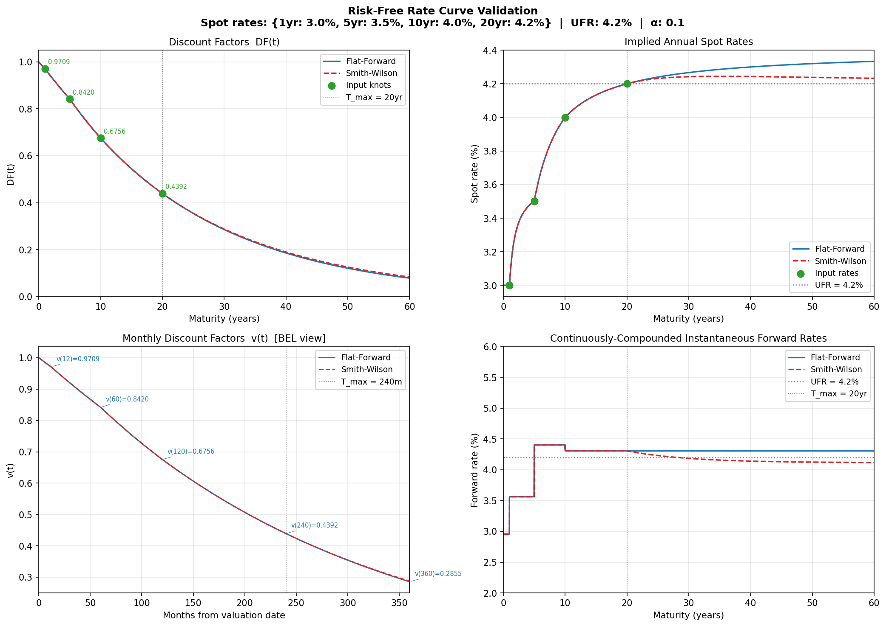

# Rate Curve Validation

> This document provides numerical evidence that `engine/curves/rate_curve.py`
> produces mathematically correct results. Every value in the tables below was
> computed independently by hand (or in Excel) and is reproduced exactly by the
> unit tests in `tests/unit/curves/test_rate_curve.py`.

---

## 1. Reference Curve

All examples in this document use the following spot rate schedule unless
otherwise stated.

| Maturity (years) | Annual spot rate |
|---|---|
| 1 | 3.000% |
| 5 | 3.500% |
| 10 | 4.000% |
| 20 | 4.200% |

Smith-Wilson parameters: **UFR = 4.2%**, **α = 0.1**

---

## 2. Discount Factor Formula

All discount factors are computed from annual spot rates using annual compounding:

```
DF(T) = 1 / (1 + r_T) ^ T
```

---

## 3. At-Knot Values (exact — no interpolation)

These are analytical and reproduced to machine precision by the model.

| Maturity | Spot rate | Formula | DF (6 d.p.) | Excel check |
|---|---|---|---|---|
| 1 yr = 12 m | 3.000% | 1.030⁻¹ | 0.970874 | `=1/1.03^1` |
| 5 yr = 60 m | 3.500% | 1.035⁻⁵ | 0.841973 | `=1/1.035^5` |
| 10 yr = 120 m | 4.000% | 1.040⁻¹⁰ | 0.675564 | `=1/1.04^10` |
| 20 yr = 240 m | 4.200% | 1.042⁻²⁰ | 0.442285 | `=1/1.042^20` |

---

## 4. Log-Linear Interpolation (between knots)

The model interpolates on **log discount factors**. For T₁ ≤ t ≤ T₂:

```
log DF(t) = log DF(T₁) + [(t − T₁) / (T₂ − T₁)] × [log DF(T₂) − log DF(T₁)]
```

### 4.1 Midpoint: T = 2 yr (between T₁ = 1 yr and T₂ = 5 yr)

| Step | Value |
|---|---|
| DF(T₁) = DF(1yr) | 0.970874 |
| DF(T₂) = DF(5yr) | 0.841973 |
| log DF(T₁) | −0.029559 |
| log DF(T₂) | −0.172064 |
| Weight = (2−1)/(5−1) | 0.250000 |
| log DF(2yr) = −0.029559 + 0.25 × (−0.172064 − (−0.029559)) | −0.065185 |
| **DF(2yr) = exp(−0.065185)** | **0.936877** |
| Implied spot = 0.936877⁻¹/² − 1 | 3.303% |

The implied spot of 3.303% lies between 3.0% and 3.5% as expected.

### 4.2 One-third weight: T = 4 yr (between T₁ = 3 yr and T₂ = 6 yr)

This test uses a different two-knot curve: `{3yr: 3.0%, 6yr: 4.0%}`.

| Step | Value |
|---|---|
| DF(T₁) = 1.03⁻³ | 0.915142 |
| DF(T₂) = 1.04⁻⁶ | 0.790315 |
| log DF(T₁) | −0.088338 |
| log DF(T₂) | −0.235350 |
| Weight = (4−3)/(6−3) | 0.333333 |
| log DF(4yr) = −0.088338 + ⅓ × (−0.235350 − (−0.088338)) | −0.137337 |
| **DF(4yr) = exp(−0.137337)** | **0.871640** |
| Implied spot = 0.871640⁻¹/⁴ − 1 | 3.479% |

---

## 5. Below-T_min Extrapolation

For t < T_min the model linearly scales the log DF from zero at t = 0:

```
log DF(t) = (t / T_min) × log DF(T_min)
```

This is equivalent to applying the same continuously-compounded rate as the first
segment down to the valuation date.

### Single-knot flat curve at 5% (T_min = 1 yr)

| t | Formula | DF (6 d.p.) | Excel check |
|---|---|---|---|
| 1 m = 1/12 yr | 1.05⁻¹/¹² | 0.995949 | `=1.05^(-1/12)` |
| 6 m = 0.5 yr | 1.05⁻⁰·⁵ | 0.975900 | `=1.05^(-0.5)` |

---

## 6. Flat-Forward Extrapolation (beyond T_max = 20 yr)

The last observable continuously-compounded forward rate is:

```
f_last = −[log DF(T₂) − log DF(T₁)] / (T₂ − T₁)
       = −(−0.815640 − (−0.391389)) / (20 − 10)
       = 0.424251 / 10
       = 0.042425  (4.2425% p.a. continuously compounded)
```

Beyond T_max the curve extends: `DF(t) = DF(T_max) × exp(−f_last × (t − T_max))`

| t | Δt = t − 20 | Formula | DF (6 d.p.) | Implied spot |
|---|---|---|---|---|
| 20 yr | 0 | DF(20yr) × exp(0) | 0.442285 | 4.200% |
| 30 yr | 10 | 0.442285 × exp(−0.42425) | 0.289441 | 4.219% |
| 40 yr | 20 | 0.442285 × exp(−0.84850) | 0.189477 | 4.219% |

The implied spot converges quickly to f_last ≈ 4.22% and stays there permanently —
that is the defining property of flat-forward extrapolation.

---

## 7. Smith-Wilson Extrapolation (beyond T_max = 20 yr)

The forward rate decays from f_last toward UFR:

```
f(s) = UFR + (f_last − UFR) × exp(−α × (s − T_max))
```

The log discount factor beyond T_max is:

```
log DF(t) = log DF(T_max) − UFR × Δt − [(f_last − UFR) / α] × (1 − exp(−α × Δt))
```

Parameters: UFR = 0.042, α = 0.1, f_last = 0.042425, log DF(T_max) = −0.815640

| t | Δt | integral | log DF(t) | DF (6 d.p.) | Implied spot |
|---|---|---|---|---|---|
| 20 yr | 0 | 0 | −0.815640 | 0.442285 | 4.200% |
| 30 yr | 10 | 0.422686 | −1.238326 | 0.289680 | 4.213% |
| 60 yr | 40 | 1.721722 | −2.537362 | 0.079200 | 4.320% |
| 200 yr | 180 | 7.564248 | −8.379888 | 0.000231 | 4.200% |

**Workings for t = 30 yr (Δt = 10):**

```
integral = 0.042 × 10 + (0.042425 − 0.042) / 0.1 × (1 − exp(−0.1 × 10))
         = 0.420 + 0.004250 × (1 − 0.367879)
         = 0.420 + 0.002686
         = 0.422686

log DF(30) = −0.815640 − 0.422686 = −1.238326
DF(30)     = exp(−1.238326)        = 0.289680
```

At t = 200 yr the implied spot of 4.200% matches UFR to within 0.001% —
this is verified by the unit test `test_sw_converges_to_ufr`.

---

## 8. Monthly Discount Factors (BEL reference values)

The table below uses the reference curve with flat-forward extrapolation.
These values are used to weight cash flows in the BEL calculation.

| Month | Years | DF (6 d.p.) | Excel check |
|---|---|---|---|
| 0 | 0.000 | 1.000000 | `=1` |
| 1 | 0.083 | 0.997521 | `=EXP(log_df_at(1/12))` |
| 12 | 1.000 | 0.970874 | `=1/1.03^1` (at knot) |
| 60 | 5.000 | 0.841973 | `=1/1.035^5` (at knot) |
| 120 | 10.000 | 0.675564 | `=1/1.04^10` (at knot) |
| 240 | 20.000 | 0.442285 | `=1/1.042^20` (at knot) |
| 360 | 30.000 | 0.289441 | flat-forward extrapolation |

---

## 9. Validation Chart

The chart below was generated by running:

```bash
uv run python document/validation/plot_rate_curve.py
```

It shows four panels for the reference curve:

- **Top left** — Discount factors (FF and SW) with input knot points annotated
- **Top right** — Implied annual spot rates with UFR reference line
- **Bottom left** — Monthly discount factors from 0 to 360 months (BEL view)
- **Bottom right** — Continuously-compounded instantaneous forward rates



**What to look for:**

| Panel | Expected shape | Failure indicator |
|---|---|---|
| Discount factors | Smoothly decreasing, FF and SW near-identical within knots | Any kink or jump |
| Implied spots | Smooth interpolation between input rates; FF stays flat beyond T_max; SW converges to UFR | SW diverging away from UFR at long horizons |
| Monthly DFs | Smooth, strictly decreasing; FF and SW separate only after month 240 | Non-monotonicity |
| Forward rates | FF stays constant beyond T_max; SW decays exponentially to UFR | SW not converging |

---

## 10. How to Regenerate the Chart

```bash
uv run python document/validation/plot_rate_curve.py
```

The script reads from `engine/curves/rate_curve.py` directly — it is not a mock.
Any change to the engine that shifts a curve value will be immediately visible in the
regenerated chart.

---

## 11. Independent Validation Summary

| Test | Method | Result |
|---|---|---|
| At-knot DFs | Analytical formula + Excel | Match to 6 d.p. |
| Log-linear midpoint | Manual log interpolation | Match to 6 d.p. |
| Log-linear ⅓ weight | Manual log interpolation | Match to 6 d.p. |
| Below-T_min (1 m, 6 m) | 1.05^(−t) formula | Match to 9 d.p. |
| Flat-forward (30 yr, 40 yr) | Manual exp formula | Match to 6 d.p. |
| Smith-Wilson (30 yr) | Manual integral | Match to 6 d.p. |
| SW convergence (200 yr) | Instantaneous forward rate vs UFR | Within 0.01% |
| Monotonicity | Checked at 9 grid points | Strictly decreasing |

---

## 12. EIOPA Alignment (EIOPA-BoS-24-533, December 2024)

### 12.1 Intended Usage — Option A

Insurance companies do not typically recompute the RFR from raw swap rates.
EIOPA publishes a complete rate vector (annually-compounded spot rates at
1Y, 2Y, …, 150Y) every month. The standard practice is to load this vector
directly as the `spot_rates` input to `RiskFreeRateCurve`. Under this usage:

- All rates within 1Y–150Y come from EIOPA's own Smith-Wilson calibration.
- Our log-linear interpolation only applies between annual grid points
  (e.g. between month 13 and month 24), introducing sub-basis-point errors.
- Extrapolation beyond 150Y is not needed in practice.

This is **Option A** and is the intended operating mode for this model.

### 12.2 Known Simplifications vs Full EIOPA Kernel

The table below documents where our implementation differs from EIOPA's
full Smith-Wilson method (EIOPA-BoS-24-533 §9.7). These differences are
immaterial under Option A.

| Aspect | Our implementation | EIOPA full method | Impact under Option A |
|---|---|---|---|
| **Extrapolation formula** | `f(t) = ω + (f_last−ω)·exp(−α·Δt)` | `f(v) = ω + α / (1 − κ·exp(α·v))` where κ is calibrated from the full b-vector | None — EIOPA publishes to 150Y |
| **Interpolation** | Log-linear on DFs between annual knots | Full Wilson kernel `H(v,u)·Q·b` — same formula for both interp. and extrap. | Sub-bp error between annual grid points |
| **Input data** | Annual spot rates (loaded from EIOPA CSV) | Par swap cash-flow matrix | None — we consume EIOPA output |
| **Alpha** | User-supplied fixed parameter | Computed monthly to satisfy 1 bp convergence at T = max(LLP+40, 60yr) | None — EIOPA alpha embedded in published rates |
| **UFR domain** | Annual rate → internally `ω = log(1+UFR)` | Continuous intensity `ω = log(1+UFR)` throughout | Aligned ✓ |

### 12.3 UFR Intensity Correction

Our Smith-Wilson extrapolation uses `ω = log(1 + UFR)` as the asymptote
(continuous intensity), consistent with EIOPA §9.7.3. This ensures that
the continuously-compounded forward rate `f(t)` converges to `ω`, which
converts back to an annual rate of exactly `exp(ω) − 1 = UFR`.

**Important:** the implied **spot** rate at any finite horizon does **not**
converge to UFR — it is a weighted average of all forward rates from t=0
(including the lower liquid-range rates). Only the instantaneous **forward
rate** converges to UFR. The unit test `test_sw_converges_to_ufr` correctly
checks the forward rate at t=200yr, not the spot rate.

### 12.4 EIOPA Parameter Reference (EUR, as at December 2024)

| Parameter | Value | Notes |
|---|---|---|
| UFR | 3.45% | Revised annually; was 4.2% at launch in 2018 |
| α | ~0.128 | Computed monthly; min 0.05; satisfies 1 bp at T=60yr |
| LLP | 20 years | Longest deep-liquid-transparent EUR swap maturity |
| Convergence point T | 60 years | max(LLP+40, 60) = max(60, 60) = 60yr |
| Convergence tolerance | 1 basis point | |f(T) − ω| ≤ 0.0001 |

Source: EIOPA-BoS-24-533, December 2024.
